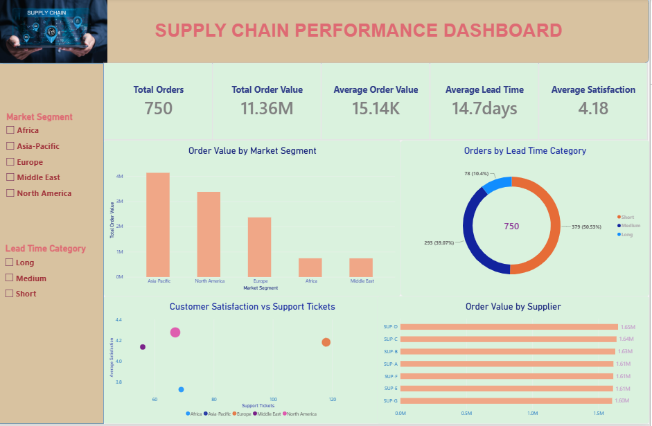

# Supply Chain Logistics Analytics

## 📊 Project Overview

This project is an end-to-end **Supply Chain Analytics** project developed to analyze supply chain performance using **Power Query, MySQL, SQL, Power BI, and DAX**.

The analysis focuses on order performance, market segments, supplier contribution, lead times, customer satisfaction, support tickets, and payment delays.

### Project Workflow

**Power Query → MySQL → SQL Analysis → Power BI → Business Insights**

---

## 🎯 Business Problem

Supply chain businesses need to monitor operational performance across different market segments and suppliers.

The objective of this project is to answer key business questions such as:

- Which market segments generate the highest order value?
- Which suppliers contribute the most to total order value?
- How are orders distributed across different lead-time categories?
- Is customer satisfaction associated with support ticket volume?
- Which market segments experience higher payment delays?
- What are the overall supply chain performance KPIs?

---

## 📂 Dataset

The cleaned dataset contains:

- **750 records**
- **14 columns**

### Key Attributes

- Customer ID
- Supplier ID
- Order ID
- Market Segment
- Order Value
- Acquisition Cost
- Lead Time
- Order Date
- Payment Date
- Payment Delay
- Customer Satisfaction
- Support Tickets
- Lead Time Category

The dataset was cleaned and transformed using **Power Query** before being loaded into MySQL for SQL analysis.

---

## 🔄 Project Workflow

### 1. Data Cleaning – Power Query

Power Query was used to prepare the raw dataset for analysis.

Key data preparation steps included:

- Promoting headers
- Correcting data types
- Removing blank rows
- Filtering unwanted records
- Cleaning text values
- Sorting data
- Creating calculated columns
- Creating Lead Time Category
- Checking column statistics and value distributions

After cleaning, the final dataset contained **750 valid records across 14 columns**.

---

### 2. SQL Analysis – MySQL

The cleaned data was imported into MySQL for business-focused analysis.

SQL techniques used include:

- `COUNT()`
- `SUM()`
- `AVG()`
- `MAX()`
- `GROUP BY`
- `ORDER BY`
- `CASE`
- `WHERE`
- Subqueries
- Window functions
- Ranking
- Aggregate analysis

The SQL analysis was designed around practical supply chain business questions and used different SQL concepts to generate actionable insights.

---

### 3. Power BI & DAX

Power BI was used to create an interactive **one-page Supply Chain Performance Dashboard**.

DAX measures were created to calculate key performance indicators dynamically.

### Key KPIs

| KPI | Value |
|---|---:|
| Total Orders | 750 |
| Total Order Value | 11.36M |
| Average Order Value | 15.14K |
| Average Lead Time | 14.7 Days |
| Average Satisfaction | 4.18 |

---

## 📈 Power BI Dashboard

The dashboard provides a consolidated view of supply chain performance.

### Dashboard Visuals

#### 1. Order Value by Market Segment

Compares total order value across different market segments to identify the highest-value markets.

#### 2. Orders by Lead Time Category

Shows the distribution of orders across:

- Short
- Medium
- Long

lead-time categories.

#### 3. Customer Satisfaction vs Support Tickets

Visualizes customer satisfaction against support ticket volume across different market segments.

#### 4. Order Value by Supplier

Compares suppliers based on their contribution to total order value.

#### 5. KPI Cards

Displays key performance indicators including:

- Total Orders
- Total Order Value
- Average Order Value
- Average Lead Time
- Average Satisfaction

---

## 🎛️ Interactive Filters

The dashboard includes slicers for:

- **Market Segment**
- **Lead Time Category**

These filters allow users to analyse supply chain performance interactively.

---

## 🖼️ Dashboard Preview



---

## 💡 Business Insights

The analysis helps stakeholders:

- Identify high-value market segments.
- Understand supplier contribution to total order value.
- Monitor order distribution by lead-time category.
- Evaluate customer satisfaction alongside support ticket volume.
- Compare payment delays across market segments.
- Monitor key supply chain KPIs from a single dashboard.
- Identify areas that may require operational improvement.

---

## 🛠️ Tools & Technologies

| Tool / Technology | Purpose |
|---|---|
| **Power Query** | Data cleaning and transformation |
| **MySQL** | Data storage and SQL analysis |
| **SQL** | Business analysis |
| **Power BI** | Interactive dashboard and visualization |
| **DAX** | KPI and analytical measures |
| **Excel / CSV** | Data source and cleaned dataset |

---

## 📁 Repository Structure

```text
Supply-Chain-Logistics-Analytics/
│
├── README.md
├── SupplyChain_Cleaned.csv
├── SupplyChain_Dashboard.pbix
├── SupplyChain_Dashboard.png
└── supplychain_sql.sql
